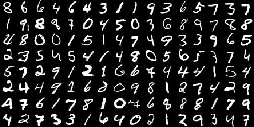
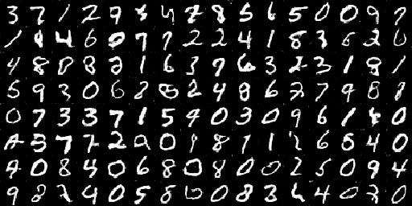

# DCGAN
这是一个深度卷积生成对抗网络的一个示例项目，使用tensorflow 实现深度卷积生成对抗网络，然后使用深度卷积生成对抗网络来生成手写数字

### 数据集选择
实验选择常见的 mnist 手写数据集，按照 MNIST/readme.txt 的要求放置在 MNIST 目录下即可。

### 环境配置和超参数：

#### 使用如下超参数进行训练
```
batch_size=128     训练时候的批次大小，默认是128
learning_rate=0.002     默认是0.002
img_sizet=32    生成图片的大小（和训练图片的大小保持一致）
z_dim=100       输入生成器的随机向量的大小，默认是100
g_channels=[128,64,32,1]     生成器的通道数目变化列表，用于构建生成器结构
d_channels=[32,64,128,256]      判别器的通道树木变化列表，用来构建判别器
init_conv_size=4        随机向量z经过全连接之后进行reshape 生成三维矩阵的初始边长，默认是 4 
beta1=0.5       AdamOptimizer 指数衰减率估计，默认是0.5
train_steps=5000    训练的次数，默认是5000次训练
```

#### 运行环境
- Windows 和 Linux 都支持，但是为了兼容性和稳定性，强烈建议使用Linux
- IDE 使用 JetBrains PyCharm
- Anaconda 2019.7 版本
- python 3.5+
- tensorflow-gpu 1.14.0 ，tensorflow2.0 可能会出现问题
- cuda 10.0 cudnnn 7.4 

### 进行训练
进入到项目目录，运行如下命令：（需要保证数据集已经下载好）
```bash
python main.py
```
上面代码执行的是默认的配置，具体的细节请见 train_argparse.py 文件中的设置

如果想要执行特定的设置，比如learning_rate 设置为 0.02 训练次数设置为 2000次，则执行下面命令：
```bash
python main.py --learning_rate=0.02 --train_steps= 2000
```
更多的命令可选参数请详见 train_argparse.py 文件

### 训练效果

**训练200次**

生成图像


真实图像


**训练500次**

生成图像


真实图像


**训练1000次**

生成图像


真实图像



**训练3000次**

生成图像


真实图像


**训练5000次**

生成图像



真实图像


